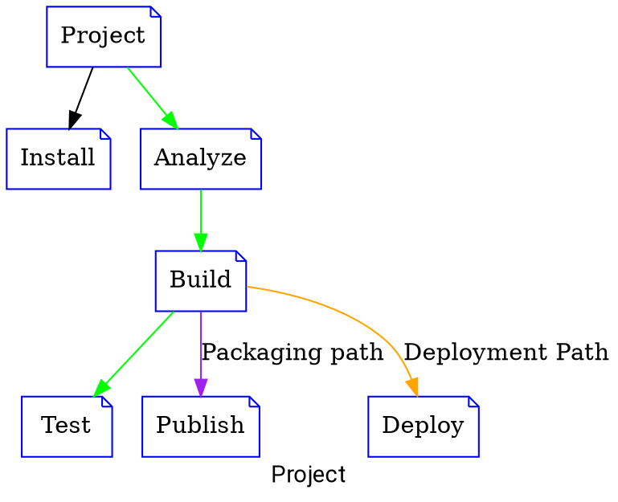

#  LinOS Connect Inventory API

This application consists of the LinOS Connect Inventory API backend services that have been forked from the linos-service-kit.

### Stack

- [NestJS](https://docs.nestjs.com/)
- [GraphQL](https://graphql.org/)
- [Docker](https://www.docker.com/)
- [Docker Compose](https://docs.docker.com/compose/)
- [Kubernetes](https://kubernetes.io/)

## Getting Started

### Prerequisite Installs

This kit has a dependency on a postgres database. The purpose of using docker-compose is to eliminate the need to install this dependency for developmental purposes.

- [docker](https://www.docker.com/get-started)
- [docker compose](https://docs.docker.com/compose/install/)
- [git](https://git-scm.com/downloads)
- [vscode](https://code.visualstudio.com/download)
- [nvm](https://github.com/nvm-sh/nvm#installing-and-updating) (Node v 12.14.1)

### Executing the application and checking initial configuration

To get started, clone this repo and then switch to the `generic-rest-inventory-api` directory and perform the following tasks:

Create the credentials file in the `generic-rest-inventory-api/config` folder.  Contact the development lead on your team or a developer on the platform team for a copy of this file.  This file by default is excluded from the project using the .gitignore and should never be checked in to version control.

Create the npmLogon dependencies using the make command from the command line:
```
make npmLogin

- input the ID found in the credentials file for this variable: LINOS_HOST_REPOSITORY_USERNAME
- input the secret found in the crdentials file for this variable: LINOS_HOST_REPOSITORY_SECRET
- input your personal levvel.io e-mail address
```


Execute this command which willl install all required components used by NPM to initialize your environment
```
make install

```

Execute this command which will build your docker image and local environment which relys on the docker-compose.yml in the core-api folder:
```
make build
```
If you get the following error on MacOSX during the build phase:
```
Got permission denied while trying to connect to the Docker daemon socket at unix:///var/run/docker.sock: Get http://%2Fvar%2Frun%2Fdocker.sock/v1.40/containers/json: dial unix /var/run/docker.sock: connect: permission denied
```
You need to add docker group to  sudo access:
`https://github.com/sindresorhus/guides/blob/master/docker-without-sudo.md`


Execute this command to launch the postgres image as well as the Node NestJS image:
```
make start
```
NOTE: If you get the following error running on windows linux subsystem on  Ubuntu 18.04:
```
postgres    | 2020-04-14 10:40:05.009 UTC [23] LOG:  database system was shut down at 2020-04-14 10:33:52 UTC
postgres    | 2020-04-14 10:40:05.017 UTC [1] LOG:  database system is ready to accept connections
service-starter-kit | npm ERR! code ENOENT
service-starter-kit | npm ERR! syscall open
service-starter-kit | npm ERR! path /app/package.json
service-starter-kit | npm ERR! errno -2
service-starter-kit | npm ERR! enoent ENOENT: no such file or directory, open '/app/package.json'
service-starter-kit | npm ERR! enoent This is related to npm not being able to find a file.
service-starter-kit | npm ERR! enoent
```
You will need to modify your docker-compose.yml file to remove the `volume:` settings:
```
    # volumes:
    #   - ".:/app"
    #   - "/app/node_modules"
```
You should see the following on your terminal window:
```
service-starter-kit | [Nest] 40   - 04/14/2020, 7:49:07 PM   [NestApplication] Nest application successfully started +97ms
```

Assuming you get a successful application launch you are ready to validate it using your browser:
http://localhost:3000/

You should see:
```linos is live```

## Project Structure

```
    ./Makefile          -project automation orchestrator.
    ./config            -project configuration files
    ./scripts           -project scripts
    ./tests             -project test scripts
```

## Project Configuration and Secrets

```
    ./config/base        -common project configuration
    ./config/credentials -secret values that should not be committed to source control
```

This kit relies on the following secret variables being present in config/credentials, which is gitignored:

```
LINOS_HOST_REPOSITORY_USERNAME
LINOS_HOST_REPOSITORY_SECRET
NPM_TOKEN
```

## Project Automation



## Project Scripts

```
    All scripts can be called via Make (as defined in the Makefile).
    Each script can orchestrate/delegate to other tools as needed to perform their function.

    ./scripts/functions.sh      -shared bash functions.
    ./scripts/install.sh        -installs development dependencies and tooling.

    ./scripts/analyze.sh        -project analysis script
    ./scripts/build.sh          -project build script
    ./scripts/test.sh           -project test executor script
    ./scripts/deploy.sh         -project deployment script
    ./scripts/publish.sh        -project artifact publishing script

    ./scripts/start.sh          -project startup script
    ./scripts/stop.sh           -project shutdown/stop script

```

## Translations

See the [backend internationalization guide](https://linos-docs.netlify.app/docs/internationalization-backend)

If you hit a route that attempts to do a translation, and you don't pass a lang header, you will see the following error:

```
[Nest] 72   - 04/28/2020, 1:36:47 PM   [I18nService] Translation "resource.property1" in "undefined" does not exist. +172459ms
```

This indicates that the translation module is using the fallback language `en`. Pass the language header with your requests to see the translation:

```
curl localhost:3000/resource -H 'lang: es'

[
  {
    "id": 1,
    "property1": "Verificación de seguridad",
    "property2": "property2",
    "property3": "property3",
    "property4": "property4"
  }
]
```

## Authorization

To fetch a test contxt token run the following command:

- `curl -X POST https://contxtauth.com/v1/oauth/token -d "{\"grant_type\":\"client_credentials\", \"audience\":\"8qY2xJob1JAxhmVhIDLCNnGriTM9bct8\", \"client_id\":\"0QQhtFcJYc8RSU8EkiMamDxu2o7vnHXr\", \"client_secret\":\"mLlYl2XbQCNC9I8qdwwFnXMU1qGpL7MEIsNSCoYmUN4GO5xo7FAmV54IcgC-Y8kh\"}" -H "Content-Type: application/json"`

Next, set the client_id you see above to the CLIENT_ID variable in the .env file. If you want to see more (or where the org id below came from), take the access_token you get from the above command and head over to jwt.io to peek at the contents.

example:

```
CLIENT_ID=8qY2xJob1JAxhmVhIDLCNnGriTM9bct8
ORG_ID=02efa741-a96f-4124-a463-ae13a704b8fc
```

## Database

Database configuration is stored in `src/ormConfig.ts` and this can be configured to accept env variables. This file imports your TypeORM entities in order to keep the database synchronized with the entities. If you add new entities to the application, make sure to import them in the ormConfig file!

The migration configuration file `src/migrationConfig.ts` simply extends this base configuration but with a different host. This allows the application to communicate with the database while running from a docker container (using ormConfig) while also allowing you to run migrations from your local machine (using migrationConfig).

### Migration commands

```sh
npm run migrate:create <name> # Create a migration file with the specified name
npm run migrate:run # Run outstanding migrations against the database
npm run migrate:generate # Generate migrations that would synchronize the database with the current state of your entity files
```

## Removing Dependencies

> Note: The below steps are to get the current example resource module configured without these dependencies

### Postgres

> Note: removing this dependency will break the links module due to there being no example controller for the links feature module as well as no mock data & configured service to use mock data

#### Dependencies to Uninstall

- pg
- typeorm
- @nestjs/typeorm

> `npm uninstall pg typeorm @nestjs/typeorm`

#### Files to Remove

- src/ormConfig.ts
- src/migrationConfig.ts
- postgres.Dockerfile
- \*.entity.ts files

#### Code to Remove:

- importing and instantiating typeORM module in app.module.ts

#### Code to Change:

- remove postgres service from docker-compose (consider removing docker-compose all-together)
- remove/comment out the current implementation of resource.service.ts & uncomment the other implementation (located at the bottom half of the resource.service.ts file) that uses the data from the mocks directory

## Configuring for linos cluster deployment

### Update `helm-chart/qa.yaml` & `helm-chart/development.yaml`

#### Replace "service-kit" with the name of application

- image -> repository
- ingress -> hosts -> paths

#### Replace 80 with application port

- service -> port
  > Note: In the future these will be configured at runtime

### Update `helm-chart/Chart.yaml`

#### Replace "service-kit" with name of application

### Adding new application environment variable(s)

#### 1.) Add new application environment variable to the `appEnvVars` in `helm-chart/qa.yaml` & `helm-chart/development.yaml`

#### 2.) Add new application environment variable entry to `helm-chart/templates/deployment.yaml` under the env property

## References

### NestJS Docs

- [NestJS Documentation](https://docs.nestjs.com/)
- [NestJS GraphQL Documentation](https://docs.nestjs.com/graphql/quick-start)
- [NestJS TypeORM Documentation](https://docs.nestjs.com/recipes/sql-typeorm)
- [NestJS CQRS Documentation](https://docs.nestjs.com/recipes/cqrs)

### GraphQL Docs

- [GraphQL Documentation](https://graphql.org/learn/)
- [Apollo Documentation](https://www.apollographql.com/docs/)

### Docker Links

- [Container vs. Image](https://stackoverflow.com/questions/23735149/what-is-the-difference-between-a-docker-image-and-a-container)

- [Docker Build Information](https://vsupalov.com/docker-arg-env-variable-guide/#targetText=Setting%20ARG%20Values&targetText=You%20can%20leave%20them%20blank,ll%20get%20an%20error%20message.&targetText=When%20you%20try%20to%20set,the%20Dockerfile%2C%20Docker%20will%20complain.)

- [Dockerfile templating](https://blog.dockbit.com/templating-your-dockerfile-like-a-boss-2a84a67d28e9)

- [Docker-Compose Documentation](https://docs.docker.com/compose/)

### VS Code Links

- [VS Code and Docker](https://code.visualstudio.com/docs/azure/docker)
- [Become a Docker poweruser in VS Code](https://brianchristner.io/docker-and-microsoft-vs-code/)
- [VS Code Remote Container](https://code.visualstudio.com/docs/remote/containers)

### NodeJS Links

- [NodeJS Container Image Best Practices](https://github.com/nodejs/docker-node/blob/master/docs/BestPractices.md)
